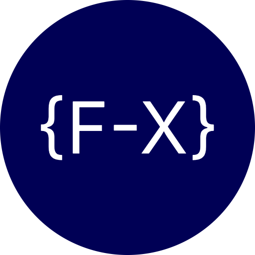

# Format-X 🚀

<div align="center">
  
  
  **A powerful tool for converting between different data formats**
  
  [](https://choosealicense.com/licenses/mit/)
  [](https://nextjs.org/)
  [](https://reactjs.org/)
  [](https://www.typescriptlang.org/)
  [](https://tailwindcss.com/)

[Live Demo](https://format-your-x.vercel.app/) • [Report Bug](https://github.com/isaias-alt/format-x/issues) • [Request Feature](https://github.com/isaias-alt/format-x/issues)

</div>

## ✨ Features

- 🔄 **Multi-format Conversion**: Convert between JSON, XML, YAML, CSV, and Plain Text
- 🚀 **Real-time Processing**: Instant conversion as you type
- 🎯 **Auto-detection**: Automatically detects input format
- 🎨 **Syntax Highlighting**: Beautiful Monaco Editor with syntax highlighting
- 📱 **Responsive Design**: Works perfectly on desktop and mobile
- 🌙 **Dark Theme**: Eye-friendly dark interface
- 📋 **Copy to Clipboard**: Easy copying of input and output
- ⚡ **Fast & Efficient**: Built with performance in mind
- 🔄 **Swap Panels**: Quickly swap input and output
- ✅ **Format Validation**: Real-time validation with error messages

## 🚀 Quick Start

### Prerequisites

- Node.js 22+
- pnpm

### Installation

1. **Clone the repository**

   ```bash
   git clone https://github.com/isaias-alt/format-x.git
   cd format-x
   ```

2. **Install dependencies**

   ```bash
   pnpm install
   ```

3. **Run the development server**

   ```bash
   pnpm dev
   ```

4. **Open your browser**

   Navigate to [http://localhost:3000](http://localhost:3000)

## 🛠️ Tech Stack

- **Framework**: [Next.js 15](https://nextjs.org/) with App Router
- **Language**: [TypeScript](https://www.typescriptlang.org/)
- **Styling**: [Tailwind CSS 4](https://tailwindcss.com/)
- **UI Components**: [shadcn/ui](https://ui.shadcn.com/)
- **Code Editor**: [Monaco Editor](https://microsoft.github.io/monaco-editor/)
- **Icons**: [Lucide React](https://lucide.dev/)
- **Notifications**: [Sonner](https://sonner.emilkowal.ski/)
- **Deployment**: [Vercel](https://vercel.com/)

## 📁 Project Structure

```
format-x/
├── public/
│   ├── logo.png
│   ├── og.webp
│   ├── robots.txt
│   └── site.webmanifest
├── src/
│   ├── app/
│   │   ├── globals.css
│   │   ├── layout.tsx
│   │   ├── page.tsx
│   │   └── sitemap.ts
│   ├── components/
│   │   ├── converter/
│   │   │   ├── converter-panels.tsx
│   │   │   ├── format-controls.tsx
│   │   │   ├── input-panel.tsx
│   │   │   ├── output-panel.tsx
│   │   │   └── status-bar.tsx
│   │   ├── ui/
│   │   │   ├── button.tsx
│   │   │   └── select.tsx
│   │   ├── code-editor.tsx
│   │   ├── footer.tsx
│   │   ├── header.tsx
│   │   └── monaco-loader.tsx
│   ├── hooks/
│   │   ├── useConverter.ts
│   │   └── useConverterActions.ts
│   └── lib/
│       ├── clipboard.ts
│       ├── constants.ts
│       ├── converters.ts
│       ├── formatDetector.ts
│       ├── formatters.ts
│       └── utils.ts
├── LICENSE
├── README.md
├── CONTRIBUTING.md
└── package.json
```

## 🎯 Usage Examples

### JSON to XML

```json
{
  "name": "John Doe",
  "age": 30,
  "skills": ["JavaScript", "React", "Node.js"]
}
```

Converts to:

```xml
<?xml version="1.0" encoding="UTF-8"?>
<root>
  <name>John Doe</name>
  <age>30</age>
  <skills>
    <item_0>JavaScript</item_0>
    <item_1>React</item_1>
    <item_2>Node.js</item_2>
  </skills>
</root>
```

### JSON to YAML

```yaml
name: John Doe
age: 30
skills:
  - JavaScript
  - React
  - Node.js
```

### Plain Text to JSON

```
name: John Doe
age: 30
email: john@example.com
```

Converts to:

```json
{
  "name": "John Doe",
  "age": "30",
  "email": "john@example.com"
}
```

## 🤝 Contributing

Please read our [Contributing Guide](CONTRIBUTING.md) to learn how you can help make Format-X even better.

### Quick contribution steps:

1. Fork the project
2. Create your feature branch (`git switch -c feature/amazing-feature`)
3. Commit your changes (`git commit -m 'Add some amazing feature'`)
4. Push to the branch (`git push origin feature/amazing-feature`)
5. Open a Pull Request

## ✨ Contributors

Thanks goes to these wonderful people:

[](https://github.com/isaias-alt/format-x/graphs/contributors)

## 📝 License

This project is licensed under the MIT License - see the [LICENSE](LICENSE) file for details.

## 🙏 Acknowledgments

- [Next.js](https://nextjs.org/) - The React Framework for Production
- [Tailwind CSS](https://tailwindcss.com/) - A utility-first CSS framework
- [Monaco Editor](https://microsoft.github.io/monaco-editor/) - The code editor that powers VS Code
- [shadcn/ui](https://ui.shadcn.com/) - Beautifully designed components
- [Lucide](https://lucide.dev/) - Beautiful & consistent icons
- [Vercel](https://vercel.com/) - Platform for deployment and hosting

## 👨‍💻 Author

**Lucas Casco**

- Website: [lucasco.dev](https://lucasco.dev)
- GitHub: [@isaias-alt](https://github.com/isaias-alt)
- 🐦 or X (whatever the freak you wanna call it): [@lucascodev](https://x.com/lucascodev)

---

<div align="center">
  <p>Made with ❤️ by <a href="https://lucasco.dev">Lucas Casco</a></p>
  <p>If you found this project helpful, please consider giving it a ⭐!</p>
</div>
